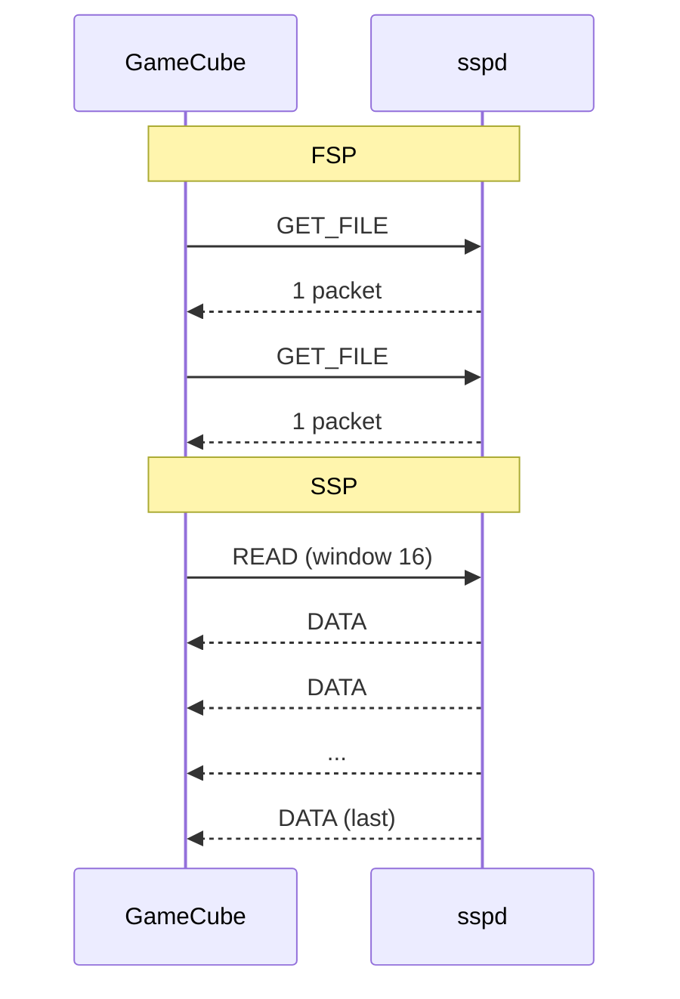

<div align="center">

# Swiss

### The all-in-one GameCube homebrew utility, rebuilt in 3D

[](#requirements)
[](LICENSE)
[](https://github.com/emukidid/swiss-gc)


*Glass cubes on the home menu, cover flow for games, a 3D file browser and animated settings pages.*

[Highlights](#highlights) •
[3D Interface](#the-3d-interface) •
[Network Streaming](#faster-network-loading-with-ssp) •
[Build It](#build-it) •
[Upstream Features](#purpose) •
[Controls](#controls)

</div>

---

## Highlights

| | |
|---|---|
| 🧊 **IPL style home menu** | Glass cubes on a rotating ring above a reflective floor, inspired by the GameCube main menu |
| 💿 **Games cover flow** | Every disc image on your device as banner cards you can glide through |
| ✨ **Glass theme** | Frosted panels, specular highlights, fresnel cubes and an animated background |
| 🎮 **Real button glyphs** | Hint bars draw the pad's own buttons: green A, red B, purple Z, grey X/Y/L/R |
| 🔊 **Menu sounds** | Bell style effects mixed straight into the audio interface, no DSP or ARAM used |
| 🌐 **Swiss Streaming Protocol** | Load games over the Broadband Adapter in paced batches instead of one packet per round trip |
| 📺 **Menu Overscan** | Pull the menus in 0-10% for TVs that crop the edges |
| 🟣 **GameCube Intro** | Optional boot animation via [cubeboot](https://github.com/OffBroadway/cubeboot) |

Everything else works as it does in upstream Swiss: the same devices, emulation, game patching and settings.

## The 3D Interface

### 🧊 Home menu
The main sections are glass cubes on a rotating ring. The selected cube comes forward and glows. Press **A** and it crouches, jumps with a spin and lands before the screen fades over to that section.

**Games · Files · Devices · Settings · System Info · Refresh · Exit**

### 💿 Games
Every disc image (`.iso`, `.gcm`, `.tgc`, `.gcz`, `.rvz`) found up to three folders deep on the current device, shown as an iTunes style cover flow. Each card shows the game's banner, title, publisher, size and region, and the cards are reflected on the floor as they glide to a new selection.

### 📁 Files
The regular Swiss file browser. The list recedes into the scene when the home menu opens, and the carousel browser turns its side cards in 3D.

### ✨ Glass theme and motion
- Frosted glass panels with a specular highlight, bevelled edges, soft shadows and an occasional sheen
- Glowing selections, and glass cubes with fresnel shading and glowing edges
- A background of tumbling cubes and drifting light
- Messages and progress boxes zoom in from depth, settings and info pages show their page as small spinning cubes, and the device picker image flips in

### 🎮 Button glyphs
The hint bars along the bottom draw each button in the GameCube pad's colours and shapes, including the Start pill and the D-Pad cross, instead of text like `(A)`. The row shrinks to fit when there are many hints.

### ⚙️ New settings
| Setting | Where | What it does |
|---|---|---|
| Menu Sounds | Interface | Turns the menu sound effects on or off |
| Menu Overscan | Interface | Shrinks the menus by 0-10% towards the centre |
| GameCube Intro | Global | Plays the original boot animation before Swiss via cubeboot, with a choice of cube colour. Needs Swiss at `/ipl.dol` and cubeboot at `/cubeboot.dol` |

## Faster Network Loading with SSP

Upstream Swiss can load games from a PC over the Broadband Adapter with FSP, but FSP fetches one packet per round trip. This fork adds the **Swiss Streaming Protocol**: one request gets back a whole batch of packets, paced so the BBA can keep up.



- **Automatic**: Swiss sends the server an SSP HELLO when the FSP device starts. If `sspd` answers, games boot with the SSP patch. With a stock FSP server, Swiss uses the FSP patch as before.
- **Recovers from drops**: each packet carries its file offset. If one is missing, or nothing arrives for 100 ms, the GameCube asks again from where it left off.
- **NAS friendly**: point `sspd` at a mounted SMB or NFS share and keep your games on the NAS.

### Run sspd
```sh
cd pc/sspd
cargo build --release
./target/release/sspd -p 7717 /path/to/gamecube/games
```

In Swiss, set **FSP Host IP**, **FSP Port** and, if you use one, **FSP Password** in Network Settings to match. See [`pc/sspd/README.md`](pc/sspd/README.md) for all options, tuning `--rate` for your hardware and the wire format.

## Build It

This fork doesn't publish releases yet, so build it yourself. With Docker, you get the same image the CI uses:

```sh
docker/build.sh dev    # quick build: cube/swiss/swiss.dol
docker/build.sh        # full release package: swiss_r*/
```

Without Docker, `make dev` needs devkitPPC and libogc2 from [devkitPro](https://devkitpro.org/). Copy `swiss.dol` to whatever you boot homebrew from.

> [!NOTE]
> This is a personal fork of [emukidid/swiss-gc](https://github.com/emukidid/swiss-gc). Please report problems with the 3D interface or SSP here, not upstream.

---

## Purpose
Swiss aims to be an all-in-one homebrew utility for the Nintendo GameCube.

### Main Features
**Can browse the following devices**
- SDSC/SDHC/SDXC Cards via [SD Gecko](https://www.gc-forever.com/wiki/index.php?title=SDGecko) or [SD2SP2](https://github.com/Extrems/SD2SP2)
- DVD±R or original Game Discs via Optical Disc Drive
- [Qoob Pro](https://www.gc-forever.com/wiki/index.php?title=Qoob) flash memory
- [USB Gecko](https://www.gc-forever.com/wiki/index.php?title=USBGecko) remote file storage
- [WASP](https://www.gc-forever.com/wiki/index.php?title=WASP_Fusion) / [Wiikey Fusion](https://www.gc-forever.com/wiki/index.php?title=Wiikey_Fusion)
- SMB, FTP, FSP via [Broadband Adapter](https://www.gc-forever.com/wiki/index.php?title=Broadband_Adapter), ENC28J60, W5500, W6100 or W6300
- [WODE Jukebox](https://www.gc-forever.com/wiki/index.php?title=Wii_Optical_Drive_Emulator)
- [IDE-EXI](https://www.gc-forever.com/wiki/index.php?title=IDE-EXI), M.2 Loader or USB Dolphin
- Memory Cards
- [GC Loader](https://www.gc-forever.com/wiki/index.php?title=GCLoader) or CUBEODE
- [FlippyDrive](https://www.gc-forever.com/wiki/index.php?title=FlippyDrive)
- [KunaiGC](https://github.com/KunaiGC/KunaiGC) flash memory
- [FlipperMCE](https://flippermce.github.io/), GCMCE or MemCard PRO GC

Note: Most devices and the exFAT filesystem are not supported by libogc and only by [libogc2](https://github.com/extremscorner/libogc2).

**Can emulate the following devices**
- Processor Interface
- DVD Interface
	- Optical Disc Drive
- External Expansion Interface
	- Broadband Adapter via [ENC28J60](https://www.microchip.com/en-us/product/enc28j60), [W5500](https://wiznet.io/products/ethernet-chips/w5500), [W6100](https://wiznet.io/products/ethernet-chips/w6100) or [W6300](https://wiznet.io/products/ethernet-chips/w6300)
	- Memory Cards via SD Cards
- Audio Streaming Interface

Note: Emulation is only available for the Dolphin SDK. Homebrew requires native drivers as provided by libogc2.

**Can provide the following services**
- Game ID for BlueRetro, FlipperMCE, MemCard PRO GC and PixelFX RetroGEM GC
- Profile selection for RetroTINK-4K using [ser2net](https://github.com/cminyard/ser2net)
- Return to loader and environment setup for [libogc2](https://github.com/extremscorner/libogc2) applications
- Return to loader for older applications using a legacy mechanism
- [wiiload](https://wiibrew.org/wiki/Wiiload) v0.5 over TCP/IP or USB Gecko

### Requirements
- GameCube with controller
- A [way to boot homebrew](https://www.gc-forever.com/wiki/index.php?title=Booting_homebrew)

### Usage
1. [Build Swiss](#build-it), or [download the latest upstream release](https://github.com/emukidid/swiss-gc/releases/latest) for the classic interface.
2. Copy the Swiss DOL file found in the DOL folder to the device/medium you are using to boot homebrew.
3. Launch Swiss, browse your device and load a DOL or GCM!

Note: Specific devices will have specific locations/executable file variants that need to be used, please check the documentation with those devices on where Swiss will need to be placed.

## Navigating Swiss
### Controls
| Control                       | Action                  |
| ----------------------------- | ----------------------- |
| Control Stick or +Control Pad | Navigate through the UI |
| A Button                      | Select                  |
| B Button                      | Open/close the home menu |
| X Button                      | Move back up a folder   |
| Z Button                      | Manage file or folder   |
| L Button                      | Move up a page          |
| R Button                      | Move down a page        |
| Start/Pause                   | Access recent list      |

In the Games cover flow, left/right moves one game, up/down or L/R jumps five and holding the Control Stick scrolls continuously.

### Swiss UI
- The top heading shows the version number, commit hash, and revision number of Swiss.
- The left panes show what device you are using.
- The largest portion is the Swiss file browser, through which you can navigate files and folders. The top of every folder includes a `..` option, and selecting this moves you back up a folder.
- The home menu (B), around the ring:
	- Games: cover flow of the games on the current device
	- Files: the file browser
	- Devices: device selection
	- Settings: Global Settings, Interface Settings, Network Settings, Global Game Settings, Default Game Settings, and Current Game Settings
	- System Info: System Info, Device Info, Hotplug Info, Version Info, and Greetings
	- Refresh: return to top of file system
	- Exit: restart GameCube
