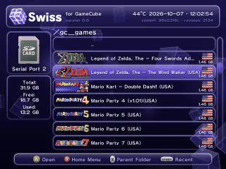

# Swiss

## Table of Contents
- [This Fork: 3D Interface](#this-fork-3d-interface)
- [Purpose](#purpose)
	- [Main Features](#main-features)
	- [Requirements](#requirements)
	- [Usage](#usage)
- [Navigating Swiss](#navigating-swiss)
	- [Controls](#controls)
	- [Swiss UI](#swiss-ui)

## This Fork: 3D Interface
This fork replaces the flat Swiss interface with a 3D one inspired by the GameCube main menu. Everything else in Swiss works as upstream.

*A recording of Swiss: the home menu, the Games cover flow, the file browser and the settings pages.*

- **Home menu**: the main sections are glass cubes on a rotating ring above a glossy, reflective floor. The selected cube comes forward and glows; pressing A makes it crouch, jump with a spin and land before the screen fades over to the chosen section. Sections: Games, Files, Devices, Settings, System Info, Refresh and Exit.
- **Games**: every disc image (`.iso`, `.gcm`, `.tgc`, `.gcz`, `.rvz`) found up to three folders deep on the current device, shown as an iTunes style cover flow of cards with the game's banner, title, publisher, size and region. The cards glide to the new selection and are reflected on the floor.
- **Files**: the regular Swiss file browser. The list recedes into the scene when the home menu opens, the carousel browser turns its side cards in 3D.
- **Glass theme**: frosted glass panels with a specular highlight, bevelled edges, soft shadows and an occasional sheen, glowing selections, glass cubes with fresnel shading and glowing edges, and an animated background of tumbling cubes and drifting light.
- **Animated dialogs**: messages and progress boxes zoom in from depth, settings and info pages show their page as small spinning cubes, the device picker image flips in.
- **Menu sounds**: short bell style sound effects generated at startup and mixed straight into the audio interface (no DSP or ARAM use, so booting games is unaffected). Can be turned off with *Menu Sounds* in the Interface settings.
- **Menu Overscan**: shrinks the menus by 0-10% towards the centre for TVs that cut off the edges of the picture (Interface settings).
- **GameCube Intro**: optional original boot animation before Swiss via [cubeboot](https://github.com/OffBroadway/cubeboot) (Global settings).

Building: `docker/build.sh dev` produces `cube/swiss/swiss.dol` using the same image as the CI (see `docker/`).

## Purpose
Swiss aims to be an all-in-one homebrew utility for the Nintendo GameCube.

### Main Features
**Can browse the following devices**
- SDSC/SDHC/SDXC Cards via [SD Gecko](https://www.gc-forever.com/wiki/index.php?title=SDGecko) or [SD2SP2](https://github.com/Extrems/SD2SP2)
- DVD±R or original Game Discs via Optical Disc Drive
- [Qoob Pro](https://www.gc-forever.com/wiki/index.php?title=Qoob) flash memory
- [USB Gecko](https://www.gc-forever.com/wiki/index.php?title=USBGecko) remote file storage
- [WASP](https://www.gc-forever.com/wiki/index.php?title=WASP_Fusion) / [Wiikey Fusion](https://www.gc-forever.com/wiki/index.php?title=Wiikey_Fusion)
- SMB, FTP, FSP via [Broadband Adapter](https://www.gc-forever.com/wiki/index.php?title=Broadband_Adapter), ENC28J60, W5500, W6100 or W6300
- [WODE Jukebox](https://www.gc-forever.com/wiki/index.php?title=Wii_Optical_Drive_Emulator)
- [IDE-EXI](https://www.gc-forever.com/wiki/index.php?title=IDE-EXI), M.2 Loader or USB Dolphin
- Memory Cards
- [GC Loader](https://www.gc-forever.com/wiki/index.php?title=GCLoader) or CUBEODE
- [FlippyDrive](https://www.gc-forever.com/wiki/index.php?title=FlippyDrive)
- [KunaiGC](https://github.com/KunaiGC/KunaiGC) flash memory
- [FlipperMCE](https://flippermce.github.io/), GCMCE or MemCard PRO GC

Note: Most devices and the exFAT filesystem are not supported by libogc and only by [libogc2](https://github.com/extremscorner/libogc2).

**Can emulate the following devices**
- Processor Interface
- DVD Interface
	- Optical Disc Drive
- External Expansion Interface
	- Broadband Adapter via [ENC28J60](https://www.microchip.com/en-us/product/enc28j60), [W5500](https://wiznet.io/products/ethernet-chips/w5500), [W6100](https://wiznet.io/products/ethernet-chips/w6100) or [W6300](https://wiznet.io/products/ethernet-chips/w6300)
	- Memory Cards via SD Cards
- Audio Streaming Interface

Note: Emulation is only available for the Dolphin SDK. Homebrew requires native drivers as provided by libogc2.

**Can provide the following services**
- Game ID for BlueRetro, FlipperMCE, MemCard PRO GC and PixelFX RetroGEM GC
- Profile selection for RetroTINK-4K using [ser2net](https://github.com/cminyard/ser2net)
- Return to loader and environment setup for [libogc2](https://github.com/extremscorner/libogc2) applications
- Return to loader for older applications using a legacy mechanism
- [wiiload](https://wiibrew.org/wiki/Wiiload) v0.5 over TCP/IP or USB Gecko

### Requirements
- GameCube with controller
- A [way to boot homebrew](https://www.gc-forever.com/wiki/index.php?title=Booting_homebrew)

### Usage
1. [Download latest Swiss release](https://github.com/emukidid/swiss-gc/releases/latest) and extract its contents.
2. Copy the Swiss DOL file found in the DOL folder to the device/medium you are using to boot homebrew.
3. Launch Swiss, browse your device and load a DOL or GCM!

Note: Specific devices will have specific locations/executable file variants that need to be used, please check the documentation with those devices on where Swiss will need to be placed.

## Navigating Swiss
### Controls
| Control                       | Action                  |
| ----------------------------- | ----------------------- |
| Control Stick or +Control Pad | Navigate through the UI |
| A Button                      | Select                  |
| B Button                      | Open/close the home menu |
| X Button                      | Move back up a folder   |
| Z Button                      | Manage file or folder   |
| L Button                      | Move up a page          |
| R Button                      | Move down a page        |
| Start/Pause                   | Access recent list      |

In the Games cover flow, left/right moves one game, up/down or L/R jumps five and holding the Control Stick scrolls continuously.

### Swiss UI
- The top heading shows the version number, commit hash, and revision number of Swiss.
- The left panes show what device you are using.
- The largest portion is the Swiss file browser, through which you can navigate files and folders. The top of every folder includes a `..` option, and selecting this moves you back up a folder.
- The home menu (B), around the ring:
	- Games: cover flow of the games on the current device
	- Files: the file browser
	- Devices: device selection
	- Settings: Global Settings, Interface Settings, Network Settings, Global Game Settings, Default Game Settings, and Current Game Settings
	- System Info: System Info, Device Info, Hotplug Info, Version Info, and Greetings
	- Refresh: return to top of file system
	- Exit: restart GameCube
